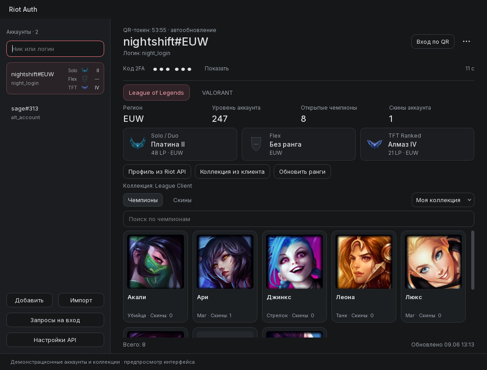
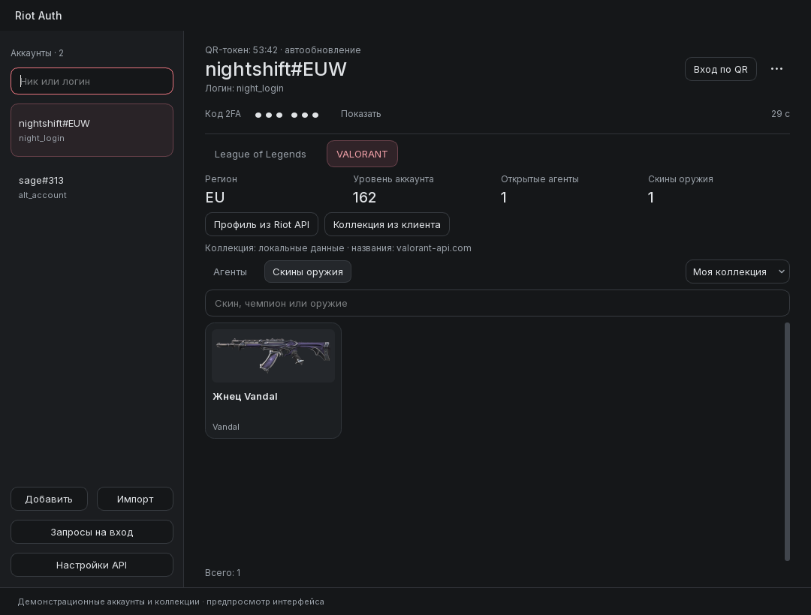
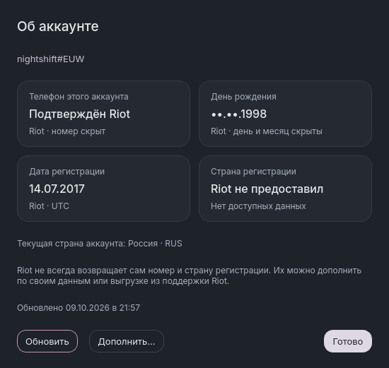

<div align="center">


# Riot SDA

**Аккаунты Riot, игровые коллекции и ранги — в одном окне.**

Приложение для Windows с поддержкой League of Legends и VALORANT.

[](#getting-started)
[](app/version.py)
[](requirements.txt)
[](app/ui)
[](LICENSE)

[Возможности](#features) · [Скриншоты](#screenshots) · [Установка](#getting-started) · [Источники данных](#data) · [Сообщить об ошибке](https://github.com/fabbiodev/Riot-SDA/issues)

<br>



<sub>Демонстрационные аккаунты. В текущем интерфейсе приложение называется Riot Auth.</sub>

</div>

<a id="features"></a>

## Возможности

| | Что доступно |
| :--- | :--- |
| **Аккаунты** | Несколько профилей, поиск по Riot ID и логину, регион и уровень аккаунта. |
| **Личные сведения** | Окно «Об аккаунте»: дата создания, доступная дата рождения и статус телефона от Riot. Номер и страну регистрации можно дополнить вручную; источники подписаны. |
| **League of Legends** | Чемпионы и скины в сетке карточек; ранги Solo / Duo, Flex и TFT Ranked с эмблемами. |
| **VALORANT** | Агенты и скины оружия с изображениями и поиском. |
| **Коллекции** | Свои предметы или полный каталог игры, метки типов скинов, поиск по типу, компактный режим и подробности по двойному щелчку или Enter. |
| **Ранги** | Обновление при запуске, после входа и каждый час; работа в трее и сохранение предыдущих данных при ошибке. |
| **QR-вход** | Сканер в отдельном окне без блокировки интерфейса, подтверждение запросов, показ времени токена и автоматическое продление, пока его разрешает Riot. |
| **Переключение аккаунтов** | Автоматическое создание сессий Riot Client из сохранённого входа Riot SDA. Кнопка «Riot Client» запускает выбранный аккаунт без QR. |
| **Аутентификатор** | Подключение Riot Mobile 2FA отдельной операцией. |
| **Интерфейс** | Тёмная тема, закруглённые карточки, плавные переходы и размер в физических пикселях, независимый от масштаба Windows. Окно можно изменять вручную. |

<a id="screenshots"></a>

## Скриншоты

Главный экран League of Legends показан выше. Ниже — коллекция VALORANT.

<details>
<summary><strong>VALORANT · скины оружия</strong></summary>



</details>

<details>
<summary><strong>Об аккаунте · личные сведения</strong></summary>



</details>

<a id="getting-started"></a>

## Установка

Скачайте [Riot SDA 1.0 для Windows](https://github.com/fabbiodev/Riot-SDA/releases/tag/v1.0.0).
`Riot2FA-Setup.exe` устанавливает приложение и создаёт ярлыки.
`Riot2FA.exe` — отдельная переносимая сборка.

### Из исходников

Нужны **Windows**, **Git** и **Python 3.11**.

```powershell
git clone https://github.com/fabbiodev/Riot-SDA.git
cd Riot-SDA

python -m venv .venv
.\.venv\Scripts\python.exe -m pip install -r requirements.txt
.\.venv\Scripts\python.exe -m patchright install chromium
.\.venv\Scripts\python.exe main.py
```

После установки зависимостей приложение также можно запускать через `start.cmd`.

### Первое использование

1. Нажмите **«Добавить»** и добавьте свой аккаунт.
2. Откройте **«Настройки API»**, проверьте сервер и полный Riot ID в формате `ник#тег`.
3. Используйте **«Профиль из Riot API»** для доступных данных профиля и **«Коллекция из клиента»** для коллекции аккаунта, открытого в игре.
4. Переключайтесь между играми, ищите чемпионов, агентов и скины. Для подробностей откройте карточку.

<a id="data"></a>

## Источники данных

| Данные | Источник | Что требуется |
| :--- | :--- | :--- |
| Solo / Duo и Flex | [Официальный открытый API OP.GG](https://github.com/opgginc/opgg-mcp) | Полный Riot ID и сервер; ключ Riot не нужен. |
| TFT Ranked | Riot TFT Developer API | Ключ с доступом к TFT API. |
| Доступные публичные данные профиля | Riot Developer API | Ключ с доступом к соответствующей игре. |
| Личная коллекция | Клиент соответствующей игры | Вход в нужный аккаунт в клиенте. |
| Личные сведения | Аккаунт Riot и RSO userinfo | Сохранённый вход в выбранный аккаунт; публичный Developer API этих полей не предоставляет. |
| Каталог и изображения | Riot Data Dragon и [VALORANT-API](https://valorant-api.com/) | Интернет для первоначальной загрузки изображений; далее используется кэш. |
| Типы скинов | Игровые данные LoL из [CommunityDragon](https://www.communitydragon.org/) и категории VALORANT-API | Публичные справочники без ключей и данных аккаунта, кэш на сутки. |

Для LoL указан тип редкости, для VALORANT — категория издания. Метки добавляются
и к ранее сохранённым коллекциям. Если источник недоступен, сохраняется предыдущий справочник;
неизвестный тип обозначается как «Тип не указан».

Окно **«Об аккаунте»** открывается рядом с логином или через меню профиля.
Сведения загружаются через сохранённый вход; кнопка **«Обновить»** повторяет запрос.
Riot может скрывать день и месяц рождения — тогда отображается только полученный год.
Дата регистрации берётся из `acct.created_at`, текущая страна показывается отдельно.
Статус подтверждения телефона не сообщает сам номер. Номер, страну регистрации и
недостающие даты можно добавить в личные заметки; приблизительные даты помечаются `≈`.
Записи хранятся в `account-details.dpapi` с защитой Windows DPAPI и не попадают в
экспорт аккаунта. Для полного набора сведений можно [запросить данные у Riot](https://support.riotgames.com/ru-ru/riot/account/requesting-your-account-data).

В подсказках рангов указаны источник и время данных. OP.GG может возвращать свой кэш;
часовой запрос не гарантирует, что сам источник уже обновился.
Если сервер ещё не задан и не загружен, используется **RU**.

Ключи можно ввести в **«Настройки API»** или задать через переменные окружения:

| Переменная | Назначение |
| :--- | :--- |
| `RIOT_API_KEY` | League of Legends API |
| `RIOT_TFT_API_KEY` | TFT API |
| `RIOT_VALORANT_API_KEY` | VALORANT API |

Введённые ключи используются только в текущем запуске и отделены от сессии входа Riot.
Публичный Developer API не выдаёт личный список приобретённых скинов.
Режим **«Каталог игры»** показывает все предметы и не подтверждает владение ими.

## Частые вопросы

<details>
<summary><strong>Нужно ли включать email 2FA, чтобы добавить профиль?</strong></summary>

Для добавления игрового профиля подключать аутентификатор не требуется.
При отдельном подключении Riot Mobile 2FA действует требование Riot о включённой email MFA.

</details>

<details>
<summary><strong>Как долго работает QR-сессия?</strong></summary>

Приложение показывает оставшееся время текущего токена и пытается продлевать его автоматически.
Общий срок SSO-сессии определяет Riot. После отзыва сессии или запроса повторной авторизации
нужно войти обычным способом. Полный выход из приложения останавливает фоновые обновления
до следующего запуска.

</details>

<details>
<summary><strong>Где хранятся аккаунты и сессии?</strong></summary>

Профили и данные подключённого аутентификатора находятся в
`%APPDATA%\Riot2FA\accounts.json`. Файл может содержать секреты 2FA и учётные данные,
сохранённые старой версией; его нельзя публиковать вместе с исходниками или отчётом об ошибке.

QR-сессии сохраняются отдельно в `%APPDATA%\Riot2FA\qr-sessions.dpapi`
с шифрованием Windows DPAPI для текущего пользователя Windows. В экспорт профиля они не входят.

Сессии Riot Client создаются в фоне для аккаунтов с действующим сохранённым входом
и хранятся отдельно в `%APPDATA%\Riot2FA\client-sessions.dpapi`, также под защитой DPAPI.
Нажмите **«Riot Client»** в выбранном профиле: приложение сохраняет текущую сессию,
закрывает клиент, восстанавливает выбранную и запускает клиент без запуска игры.
Открытую игру сначала нужно закрыть. Если вход не восстановится, приложение возвращает
прежнюю сессию. После отзыва сессии Riot может потребовать обычный повторный вход;
он доступен в меню аккаунта через **«Обновить вход для Riot Client…»**.
Для импортированного профиля без сохранённой авторизации сначала нужен вход в Riot SDA.

</details>

## Разработка

<details>
<summary><strong>Тесты и предпросмотр интерфейса</strong></summary>

Тесты используют искусственные аккаунты и подменённые сетевые ответы:

```powershell
.\.venv\Scripts\python.exe -m unittest discover -s tests -q
```

Создать скриншоты с демонстрационными данными и публичными изображениями:

```powershell
.\.venv\Scripts\python.exe tests\render_dashboard.py design-preview --live-artwork --grid-fixtures
```

</details>

<details>
<summary><strong>Сборка Windows</strong></summary>

```powershell
.\.venv\Scripts\python.exe -m pip install -r build\requirements-build.txt
$env:RIOT2FA_ONEDIR = '1'
.\.venv\Scripts\python.exe -m PyInstaller --noconfirm build\Riot2FA.spec
```

Результат: `dist/Riot2FA/Riot2FA.exe`. Папка `_internal` должна находиться рядом с EXE:
она содержит браузер для входа Riot, шрифт, эмблемы рангов и зависимости.

Если существует `build/obf/main.py`, spec использует эту обфусцированную версию.
Для сборки текущих обычных исходников такой каталог должен отсутствовать.
Автоматическое обновление из исходного upstream в этой версии отключено.

Исходник иконки — [images/icon.svg](images/icon.svg). Пересоздать PNG и ICO:

```powershell
.\.venv\Scripts\python.exe build\render_app_icon.py
```

</details>

Нашли ошибку? [Создайте issue](https://github.com/fabbiodev/Riot-SDA/issues)
с шагами воспроизведения, версией приложения и скриншотом без личных данных.

## Благодарности и лицензия

Проект основан на [RiotGames-Mobile-2FA-Bypass](https://github.com/Askin242/RiotGames-Mobile-2FA-Bypass).
Исходные авторские уведомления сохранены в [MIT License](LICENSE).

Эмблемы рангов предоставлены Riot Games; ссылки на источники находятся в
[app/assets/ranks/SOURCES.md](app/assets/ranks/SOURCES.md).
Лицензия шрифта — [SIL Open Font License](app/assets/fonts/OFL.txt).

Riot SDA — независимый проект, не связанный с Riot Games или OP.GG.
League of Legends, VALORANT и игровые материалы принадлежат соответствующим правообладателям.
